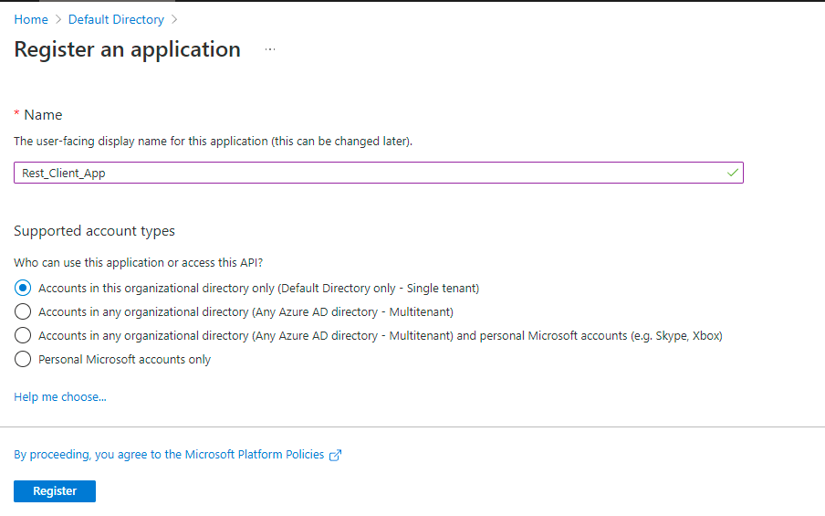

# Overview
This Article describe how to call Azure REST API

# Register client application with Azure AD

Most Azure services (such as Azure Resource Manager providers and the classic deployment model) require your client code to authenticate with valid credentials before you can call the service's API. Authentication is coordinated between the various actors by Azure AD, and provides your client with an access token as proof of the authentication. The token is then sent to the Azure service in the HTTP Authorization header of subsequent REST API requests. 

# Register the client application with Azure AD



# Give access to client application over azure subscription

# Fetch access token using postman

```
{
    "token_type": "Bearer",
    "expires_in": "3599",
    "ext_expires_in": "3599",
    "expires_on": "1633776251",
    "not_before": "1633772351",
    "resource": "https://management.core.windows.net/",
    "access_token": "Token Here"
}
```

# Call Azure REST API

